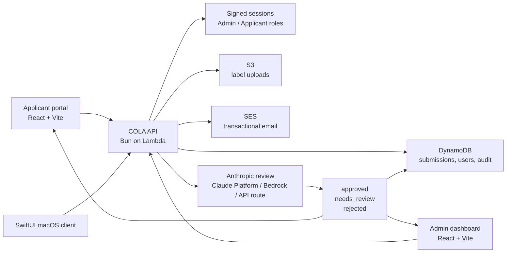

# COLA Label Verification

AI-assisted alcohol label verification for COLA applications, built as a fullstack Treasury-style prototype with a React applicant/admin portal, a SwiftUI macOS client, an AWS-hosted API, Anthropic model review, SES transactional email, and dataset-backed tests against accepted real-world COLA records.


[](https://bun.sh)
[](https://vite.dev)
[](https://developer.apple.com/xcode/swiftui/)
[](https://aws.amazon.com)
[](https://www.anthropic.com)
[](docs/TESTING.md)

## What This Is

This project is a production-shaped prototype for reviewing Certificate of Label Approval (COLA) submissions. Applicants submit label images and product metadata. The backend runs deterministic validation plus an Anthropic vision/reasoning model path, records a structured decision, sends transactional email, and gives Treasury reviewers an admin queue for review and override.

The system is intentionally built as a human-supervised workflow. The model can approve, reject, or route to review, but admin users remain the final authority for override decisions.

## Demo Surfaces

| Surface | Purpose | Status |
| --- | --- | --- |
| [cola-mail-sandbox-2026.xyz](https://cola-mail-sandbox-2026.xyz) | Public web portal for login, applicant submission, applicant status, and admin review | Deployed |
| [api.cola-mail-sandbox-2026.xyz/health](https://api.cola-mail-sandbox-2026.xyz/health) | API health and configured AI-provider status | Deployed |
| `apps/macos` | Native SwiftUI client targeting the same API contract | Prototype |
| `.codex/cola_cloud_250` | Accepted COLA fixture dataset for regression tests | Local only |

## Goals Accomplished

- Built a monorepo with React/Vite/Bun, SwiftUI, a Bun API service, shared domain logic, tests, scripts, and AWS CDK infrastructure.
- Added applicant and admin account flows with signed bearer sessions.
- Enforced strict access boundaries: applicants can only see their own applications, and only admins can view the admin queue or override decisions.
- Implemented applicant COLA submission with structured product fields, image upload, drag/drop support, processing state, duplicate-submit protection, and status toasts.
- Implemented an admin review dashboard with queue filtering, evidence inspection, decision confidence, and required-reason overrides.
- Integrated model-backed review through Anthropic routes, including image inputs and fail-closed behavior when the configured model is unavailable.
- Added SES transactional email templates styled around the Treasury Digital Design System.
- Verified SES domain identity, DKIM, SPF, and custom MAIL FROM for `cola-mail-sandbox-2026.xyz`.
- Deployed the frontend through S3/CloudFront and the backend through AWS Lambda.
- Added dataset-backed tests proving all 250 accepted real-world COLA examples avoid automated hard rejection.
- Added synthetic negative tests for actual rejection behavior instead of misusing the accepted-only dataset.

## Architecture At A Glance



## Workspace Layout

| Path | Role |
| --- | --- |
| `apps/web` | React + Vite web app for applicant and admin workflows. Uses Bun for package management. |
| `apps/macos` | SwiftUI macOS app skeleton for the same applicant/admin API workflows. |
| `services/api` | Bun HTTP API, Lambda entrypoint, auth, persistence adapters, AI review pipeline, SES email, and route tests. |
| `packages/shared` | Shared TypeScript domain models, COLA normalization, deterministic validators, fixture loaders, and decision tests. |
| `infra` | AWS CDK stack for Cognito-oriented auth, S3, DynamoDB, Lambda/API, SES permissions, and deployment plumbing. |
| `scripts` | Live verification and AWS deployment helpers for Anthropic routes and web/domain setup. |
| `docs` | Focused architecture and testing notes. |
| `.codex/cola_cloud_250` | Local accepted-COLA dataset fixture. It is intentionally not uploaded by infrastructure. |

## Product Flow

### Applicant Portal

1. A user lands at the root site and signs in or creates an applicant account.
2. The applicant sees only their own dashboard.
3. They walk through a COLA submission wizard.
4. They enter brand, product, product type, class, origin, ABV, volume, producer, and label details.
5. They upload label images through a file picker or drag/drop area.
6. The UI prevents duplicate submissions and shows a processing state while the API and model route run.
7. The applicant receives a submission confirmation and can track their own status.

### Admin Dashboard

1. Admin users sign in through the same root login page.
2. Server-side role checks route admins to the review dashboard.
3. Admins can filter the queue, inspect submitted fields, inspect model evidence, and review field-level differences.
4. Admins can approve, reject, or request review.
5. Overrides require a reason and are written to the audit trail.
6. Applicants receive decision-update email when an override changes the status.

## AI Decision Pipeline

The review pipeline returns a structured decision object rather than freeform prose:

- `approved`
- `needs_review`
- `rejected`

Each decision includes confidence, concise rationale, and evidence fields. The app does not expose chain-of-thought. It stores only decision summaries and evidence that are appropriate for human review.

The current implementation supports these routes:

| Route | Purpose |
| --- | --- |
| Claude Platform on AWS | AWS-billed Anthropic-native Messages API route for live image-backed decisions. |
| Amazon Bedrock Anthropic | Preferred AWS/GovCloud-aligned model boundary when account quotas are enabled. |
| Direct Anthropic Messages API | Optional first-party route for demos/evaluation when approved. |
| Deterministic validators | Local rule checks for field comparison, normalization, mismatch detection, and review routing. |
| RunPod/open-weight models | Reserved for offline evaluation with public, synthetic, or sanitized data. Real applicant data is not routed there by default. |

The deployed API is intentionally fail-closed for model review. If the configured Anthropic provider cannot invoke a model, the API returns `503` and does not persist a fallback decision pretending to be reviewed.

## Security Model

Security is implemented in the backend, not only in the UI:

- Login returns signed bearer sessions.
- Applicant registration creates applicant-only accounts.
- Admin emails are reserved through server-side configuration.
- Applicants cannot register using an admin-reserved email.
- Applicants can list/read only submissions where their user id matches the submission owner.
- Admin queue and override routes require the `admin` role.
- Admin override requests require a reason.
- The API ignores forged client-side role headers and derives identity from the verified token.
- Inline uploaded image data is stripped before persistence after the model receives it.

## Email System

SES is used for transactional email:

- Applicant submission confirmation.
- Applicant decision/status updates.
- Admin override notifications.
- Admin alerts for new submissions.

The domain `cola-mail-sandbox-2026.xyz` is configured as the sending identity with DKIM, SPF, and custom MAIL FROM.

Current SES caveat: production access must be approved by AWS before the domain can send to arbitrary registered users. While SES is in sandbox mode, AWS only allows delivery to verified recipient identities. The production-access support case has been submitted with the transactional account-email use case.

## Dataset-Backed Confidence

The repo includes a local fixture dataset at `.codex/cola_cloud_250`:

- 250 accepted COLA applications.
- 411 downloaded label images.
- JSONL, CSV, TTB ID, and summary metadata.

Tests use the dataset as accepted-only truth data. That means the dataset should never be used to prove rejection behavior. Instead:

- Accepted examples must not receive an automated hard rejection.
- Ambiguous accepted examples may route to `needs_review`.
- Optional missing fields such as ABV, net contents, or barcode are non-fatal.
- Known category noise becomes a review signal, not a rejection.
- Synthetic negative fixtures cover true rejection paths.

## Local Setup

Install dependencies:

```bash
bun install
```

Create a local environment file when you need live providers:

```bash
cp .env.example .env.local
```

Local development works without AWS credentials by default. The API uses in-memory storage and console email unless AWS toggles are enabled.

Run the API and web app:

```bash
bun run dev:api
bun run dev:web
```

Run tests:

```bash
bun test
```

Run a full type/build pass:

```bash
bun run build
```

## Live Anthropic Verification

Load local secrets first:

```bash
set -a; source .env.local; set +a
```

Try every configured live Anthropic route and configure Lambda for the first one that works:

```bash
bun run verify:live-any-anthropic
```

Check readiness without submitting a live application:

```bash
bun run check:live-anthropic-readiness
```

Check direct Anthropic only:

```bash
bun run verify:live-anthropic-api
```

Check Claude Platform on AWS:

```bash
bun run verify:live-anthropic
```

Check Bedrock Anthropic:

```bash
bun run verify:live-bedrock-anthropic
```

## AWS Deployment Shape

The deployment is shaped around these AWS services:

- S3 + CloudFront for the React frontend.
- Lambda for the Bun API bundle.
- DynamoDB for submissions, users, decisions, and audit records.
- S3 for uploaded label documents/images.
- SES for transactional email.
- Route 53 + ACM for custom web/API domains.
- Bedrock or Claude Platform on AWS for model-backed decision summaries.
- Cognito-oriented infrastructure scaffolding for enterprise auth alignment.

The app can still be built locally without AWS credentials.

## Useful Commands

| Command | Purpose |
| --- | --- |
| `bun install` | Install monorepo dependencies. |
| `bun run dev:api` | Start the local API server. |
| `bun run dev:web` | Start the local React app. |
| `bun test` | Run unit and dataset-backed tests. |
| `bun run build` | Build/typecheck shared packages, API, web, and infra. |
| `bun run --filter @cola/api bundle:lambda` | Produce the Lambda bundle. |
| `bun run --filter @cola/web build` | Produce the web production bundle. |
| `bun run verify:live-any-anthropic` | Probe live Anthropic routes and run deployed API E2E. |
| `bun run deploy:aws-web-domain` | Update CloudFront/domain aliases for the hosted app. |

## Future Improvements

- Move from prototype signed sessions to Cognito Hosted UI or a full enterprise identity provider integration.
- Add durable Step Functions orchestration for asynchronous submission processing.
- Add Textract or Bedrock Data Automation extraction before model review.
- Add S3 pre-signed direct uploads for larger PDFs/images.
- Add SES production access approval and event publishing for bounce/complaint handling.
- Add CloudWatch dashboards, alarms, and structured request tracing.
- Add admin audit export and reviewer assignment.
- Add richer applicant document history and resubmission flows.
- Expand the macOS app from API skeleton into a polished native review/submission client.
- Add IaC-driven environment promotion for dev, staging, and production.
- Add stricter content validation for file type, size, malware scanning, and document retention.

## Design Notes

The web UI uses a Treasury Digital Design System-inspired visual direction while staying intentionally functional and prototype-friendly. The applicant and admin flows are usable enough for end-to-end review, but the visual system is still ready for deeper design iteration.

## License

No open-source license has been selected yet. Treat the code as private project material until a license is added.
